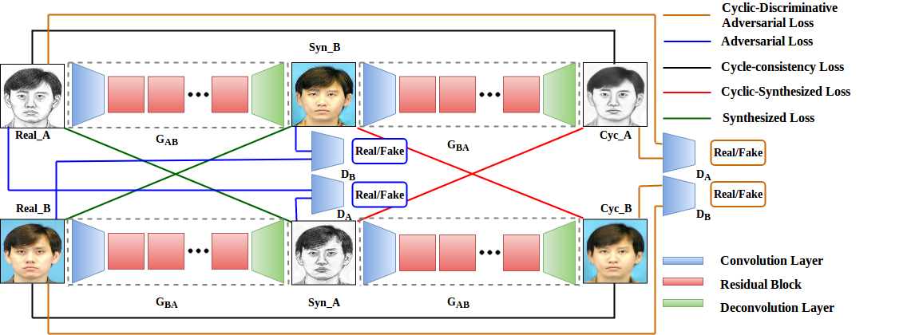

# CDGAN
CDGAN: Cyclic Discriminative Generative Adversarial Networks for Image-to-Image Transformation

# CDGAN Implementation in PyTorch
This is the implementation of our paper called <b>"CDGAN: Cyclic Discriminative Generative Adversarial Networks for Image-to-Image Transformation".
<a href="https://arxiv.org/abs/1901.03554">https://arxiv.org/abs/2001.05489</a>.
  
# CDGAN Architectue

   
  
  
## Acknowledgments
- We gratefully acknowlege the NVIDIA Corp. for donating us the NVIDIA GeForce Titan X Pascal GPU used for this research.

- code is heavily borrowed from CycleGAN Paper [pytorch-CycleGAN](https://github.com/junyanz/pytorch-CycleGAN-and-pix2pix).
